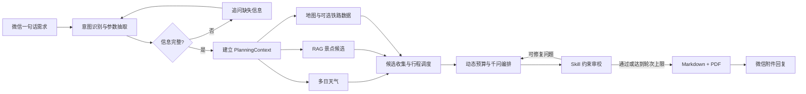

# 智能旅行规划微信 Agent

一个基于 Java 21、微信 iLink SDK 与通义千问构建的自主规划型旅行助手。用户只需用一句话描述出发地、目的地、日期、天数、人数、预算和偏好，Agent 会自行拆解任务，调用天气、旅行知识库、地图与预算工具，审校结果并返回 Markdown 和 PDF 旅行方案。

> 项目定位为教学与演示用途的 MVP。天气、交通、票价和景点营业信息来自第三方服务，出行前仍需通过官方渠道复核。

## 项目状态

| 项目 | 状态 |
|---|---|
| 当前版本 | `v2.0.0` MVP |
| Java 版本 | JDK 21 |
| 自动化测试 | 93 项通过 |
| 主要入口 | 微信文字、图片和语音 |
| 输出格式 | Markdown、中文 PDF |

`v2.0.0` 重点完善了动态预算、真实交通候选、多日天气适配、规划审校闭环、断点续跑和外部服务保护。详细变化见 [CHANGELOG.md](CHANGELOG.md)。

## 核心能力

- **自主任务拆解**：从一句自然语言目标中提取旅行参数，依次完成天气查询、景点检索、行程编排、动态预算和方案审校。
- **规划闭环**：采用 `Plan → Evaluate → Repair`，可修复的超支、重复景点、闭馆景点和天数问题会自动调整后再次验证。
- **微信多模态交互**：支持文字聊天、图片理解、语音识别与语音回复。
- **RAG 旅行知识库**：使用 `qwen3.7-text-embedding` 召回本地旅行知识；知识库外城市由千问通用知识兜底。
- **Skill 约束审校**：内置旅行规划与方案审校 Skill，可发现预算、行程强度和重复景点等问题。
- **多日天气规划**：使用 Open-Meteo 获取行程日期内的逐日天气；超出预报范围时明确降级说明。
- **动态地图增强**：可选接入百度地图，规划前补充景点地址、评分、开放时间和交通候选，并估算行程内相邻地点交通。
- **动态预算**：往返交通、住宿、餐饮、市内交通、门票和机动金按实际行程重新核算，未使用预算会作为余额保留。
- **轻量真实性调度**：综合推荐往返班次、多日天气、POI坐标和用户步行偏好，压缩首尾日、调整雨天项目并减少跨区折返。
- **结构化交付**：生成排版后的 Markdown 与中文 PDF 附件。
- **上下文与断点续跑**：保存短期对话和未完成旅行任务，支持补充出发地、目的地及继续执行。
- **证据检查点**：天气、RAG与交通证据默认保存6小时，失败后重试可跨进程复用，减少重复API调用。
- **Provider保护**：百度与天气服务具有超时、限流和熔断；铁路服务另有显式开关、每日额度与缓存保护。
- **质量观测**：每次规划记录天气、POI、坐标、开放时间、往返交通、价格和市内路段覆盖率。
- **通用工具调用**：提供天气、计算器和日期时间工具，支持串行与并行调用。

## 工作流程



## 技术栈

| 模块 | 技术 |
|---|---|
| 语言与构建 | Java 21、Maven |
| 微信接入 | WeChat iLink SDK |
| 大模型 | 阿里云百炼 / 通义千问 |
| 向量模型 | `qwen3.7-text-embedding` |
| 网络与 JSON | OkHttp、Jackson |
| 天气 | Open-Meteo；心知天气用于通用天气工具 |
| 地图 | 百度地图 Web API（可选） |
| 文档 | CommonMark、OpenHTMLToPDF、PDFBox |
| 测试 | JUnit 5、MockWebServer |

## 快速开始

### 1. 环境要求

- JDK 21
- Maven 3.9 或更高版本
- 可用的阿里云百炼 API Key
- FFmpeg（仅在语音合成结果需要转码时使用）
- IntelliJ IDEA（可选）

检查本地环境：

```bash
java -version
mvn -version
ffmpeg -version
```

### 2. 配置环境变量

进入项目目录并复制配置模板：

```bash
cd 姽婳/wechat-bot
cp .env.example .env
```

至少填写：

```dotenv
DASHSCOPE_API_KEY=your_dashscope_api_key
QWEN_MODEL=qwen3.8-max
WECHAT_LLM_REPLY_ENABLED=true
```

常用可选配置：

```dotenv
# 语音与向量模型，可复用同一个百炼 API Key
QWEN_ASR_MODEL=qwen3-asr-flash
QWEN_TTS_MODEL=qwen3-tts-flash
QWEN_EMBEDDING_MODEL=qwen3.7-text-embedding

# 心知天气 Key，仅供通用 weather_query 当前天气工具使用；
# 旅行 Agent 的多日预报使用无需 Key 的 Open-Meteo
SENIVERSE_API_KEY=

# 百度地图服务端 AK；不配置时旅行 Agent 仍可运行
BAIDU_MAP_AK=
BAIDU_MAP_MAX_POI_QUERIES=3

# 聚合数据铁路查询（可选）；默认关闭，仅查询未来15天
JUHE_RAIL_ENABLED=false
JUHE_RAIL_API_KEY=
JUHE_RAIL_DAILY_LIMIT=10
JUHE_RAIL_CACHE_MINUTES=360

# RAG 开关
TRAVEL_RAG_ENABLED=true

# 旅行证据检查点有效期，失败重试时复用天气、RAG和交通结果
TRAVEL_CHECKPOINT_HOURS=6
```

模板只保留常用配置；接口地址、提示词、超时和 RAG 阈值等高级参数均有内置默认值，需要调试时再通过同名环境变量覆盖。

`.env`、微信会话、日志和运行时缓存已被 `.gitignore` 排除，禁止将真实密钥复制进源码或提交记录。

### 3. 构建与测试

```bash
mvn clean test
mvn clean package
```

可执行 Fat JAR 将生成在：

```text
target/wechat-ilink-sdk-2.3.3-bot.jar
```

### 4. 启动 Bot

命令行启动：

```bash
java -jar target/wechat-ilink-sdk-2.3.3-bot.jar
```

IDEA 启动：

1. 使用 IDEA 打开 `wechat-bot/pom.xml`。
2. 将 Project SDK 和 Maven Runner JDK 设置为 Java 21。
3. 运行 `com.github.wechat.ilink.bot.WeChatBotApplication`。

首次运行时按照终端提示打开二维码并在微信中确认授权。授权信息保存在本地 `runtime/`，后续启动会优先恢复会话。停止程序可使用 IDEA 的停止按钮或终端 `Ctrl+C`。

## 使用示例

完整旅行目标：

```text
2026年10月20日从常州去西安玩4天，2人预算5000元，喜欢历史和美食，节奏轻松
```

缺少信息时，Bot 会追问后再生成文档：

```text
用户：从常州去玩4天，2人预算5000元
Bot：为了生成完整方案，请告诉我目的地是哪里。
用户：苏州
```

其他能力示例：

```text
帮我查杭州未来三天的天气
计算 (128 + 72) * 3
现在北京时间是多少
```

## 项目结构

```text
.
├── README.md
├── CHANGELOG.md
└── 姽婳/
    └── wechat-bot/
        ├── pom.xml
        ├── .env.example
        ├── THIRD_PARTY_NOTICES.md
        └── src/
            ├── main/
            │   ├── java/com/github/wechat/ilink/
            │   │   ├── bot/          # Agent、消息路由、RAG、Skill、工具与外部服务
            │   │   └── sdk/          # 微信 iLink SDK
            │   └── resources/
            │       ├── skills/       # 旅行规划与审校 Skill
            │       └── travel-rag/   # 已构建的本地向量索引
            └── test/                 # 单元、边界、降级与文档渲染测试
```

以下目录只在本地运行时产生，不会进入版本控制：

| 路径 | 内容 |
|---|---|
| `.env` | 本地密钥与运行配置 |
| `runtime/` | 微信授权、对话记忆和旅行任务状态 |
| `logs/` | 运行日志 |
| `target/` | Maven 构建产物 |
| `output/`、`tmp/` | 测试输出和临时媒体文件 |

## 设计边界

- 本地旅行知识库当前重点覆盖上海、杭州和苏州；其他中国城市由千问通用知识生成，并在文档中提示核验动态信息。
- Open-Meteo 只能返回其预报窗口内的天气。超出范围时仍生成旅行计划，但不会虚构天气。
- 同时配置铁路 Key 并将 `JUHE_RAIL_ENABLED=true` 后，未来15天内优先查询可预订铁路班次和参考席位价格；关闭、达到本地每日上限、超出日期窗口或接口失败时回退百度交通与12306查询入口。
- 铁路数据用于规划与预算参考，余票和最终成交价格仍需通过12306确认。
- 景点评分、开放时间、票价和预约规则可能变化，演示结果不能代替官方信息。
- 微信 iLink 接口及账号权限可能随平台策略变化，请遵守平台规则并控制调用频率。

## 安全说明

- 不要提交 `.env`、`runtime/`、日志、二维码或旅行方案输出文件。
- API Key 若曾出现在聊天、截图或提交历史中，应在对应平台立即轮换。
- 百度地图个人免费额度有限，建议降低 `BAIDU_MAP_MAX_POI_QUERIES` 并避免高频真实联调。
- 聚合数据铁路免费额度较低，默认关闭。启用后程序会记录当日调用次数、缓存相同路线与日期，并在额度错误时熔断至次日；不要为了测试重复更换日期和路线。
- `runtime/travel-evidence-checkpoints.json` 保存短期旅行证据且已被 Git 忽略；其中可能包含用户旅行目标对应的地点信息，部署时应限制文件访问权限并定期清理。
- 上传前可执行 `git status --ignored`，确认所有本地凭据与运行状态均处于 ignored 状态。

## 第三方项目

本项目参考并使用了部分开源项目的设计与代码，许可及来源见 [THIRD_PARTY_NOTICES.md](姽婳/wechat-bot/THIRD_PARTY_NOTICES.md)。

## 版本与更新

- 当前稳定演示版本：`v2.0.0`
- 更新记录：[CHANGELOG.md](CHANGELOG.md)
- GitHub 上的每次提交都会保留历史；需要对外发布固定版本时，可基于 Tag 创建 Release。

## 反馈与贡献

欢迎通过 Issue 提交问题复现、改进建议和新的旅行知识数据。提交代码前请确保：

```bash
mvn clean test
```
